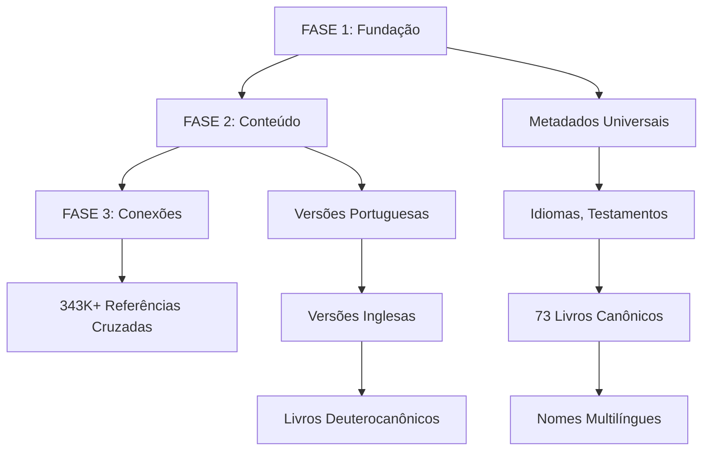

# Database Population Guide

**Versão:** 2.0
**Data:** 2025-09-08
**Status:** Production Ready

## Visão Geral

Este guia descreve o processo completo de população da base de dados da Bible API, desde uma base vazia até uma implementação completa com 600K+ versículos e 340K+ referências cruzadas.

## Arquitetura de Dados

A população segue uma arquitetura de **3 fases sequenciais** baseada no blueprint do projeto:



## Pré-requisitos

### Sistema
- Docker e Docker Compose instalados
- Acesso aos diretórios de dados:
  - `inst/json/` (13 versões portuguesas)
  - `bible_databases-2024/` (5 versões inglesas + referências)
  - `bible_databases_deuterocanonical/` (livros apócrifos)

### Base de Dados
- PostgreSQL rodando via Docker
- Migrações aplicadas
- Base de dados vazia ou limpa

## Comandos de População

### Preparação do Ambiente

```bash
# 1. Limpar e reconstruir containers
docker-compose down
docker-compose build
docker-compose up -d

# 2. Verificar serviços
docker-compose ps

# 3. Aplicar migrações (OBRIGATÓRIO)
docker-compose exec web python manage.py migrate

# 4. Verificar estrutura (opcional)
docker-compose exec web python manage.py showmigrations
```

### FASE 1: Fundação - Metadados Universais

```bash
# Criar metadados base: idiomas, testamentos, 73 livros canônicos
docker-compose exec web python manage.py seed_01_metadata
```

**Output esperado:**
- ✅ 2 Languages (pt-BR, en-US)
- ✅ 3 Testaments (Antigo, Novo, Apócrifo)
- ✅ 73 CanonicalBooks (66 canônicos + 7 deuterocanônicos)
- ✅ 146+ BookNames (multilíngue)

**Tempo:** ~30 segundos

### FASE 2: Conteúdo - Versões Bíblicas

#### 2.1 Versões Portuguesas
```bash
# Popular 13 versões em português do diretório inst/json/
docker-compose exec web python manage.py populate_bible_data
```

**Output esperado:**
- ✅ 13 Versions (ARA, ARC, NVI, etc.)
- ✅ ~400K Verses (31K per version)

**Tempo:** 5-10 minutos

#### 2.2 Versões Inglesas
```bash
# Popular 5 versões em inglês (KJV, ASV, BBE, WEB, YLT)
docker-compose exec web python manage.py populate_foreign_versions
```

**Output esperado:**
- ✅ 5 Versions (EN_KJV, EN_ASV, etc.)
- ✅ ~155K Verses (31K per version)

**Tempo:** 3-5 minutos

#### 2.3 Livros Deuterocanônicos
```bash
# Popular 7 livros apócrifos/deuterocanônicos
docker-compose exec web python manage.py populate_deuterocanon
```

**Output esperado:**
- ✅ 1 Version (EN_APOCRYPHA)
- ✅ ~5K Verses (7 deuterocanonical books)

**Tempo:** ~30 segundos

### FASE 3: Conexões - Referências Cruzadas

```bash
# Popular 343K+ referências do OpenBible.info
docker-compose exec web python manage.py populate_cross_references
```

**Output esperado:**
- ✅ ~340K CrossReferences
- ✅ Suporte a ranges de versículos
- ✅ Sistema de votos/relevância

**Tempo:** 10-15 minutos

## Verificação e Validação

### Verificação Rápida
```bash
docker-compose exec web python manage.py shell -c "
from bible.models import *
print(f'📊 DATABASE POPULATION STATUS')
print(f'Languages: {Language.objects.count()}')
print(f'Testaments: {Testament.objects.count()}')
print(f'CanonicalBooks: {CanonicalBook.objects.count()}')
print(f'BookNames: {BookName.objects.count()}')
print(f'Versions: {Version.objects.count()}')
print(f'Verses: {Verse.objects.count():,}')
print(f'CrossReferences: {CrossReference.objects.count():,}')
"
```

### Valores Esperados (População Completa)
```
📊 DATABASE POPULATION STATUS
Languages: 2
Testaments: 3
CanonicalBooks: 73
BookNames: 146+
Versions: 19
Verses: ~600,000
CrossReferences: ~340,000
```

### Verificação Detalhada
```bash
# Testar API endpoints
curl http://localhost:8000/api/v1/books/ | jq '.[0:3]'
curl http://localhost:8000/api/v1/verses/?book=Gen&chapter=1 | jq '.results[0:3]'
curl http://localhost:8000/api/v1/versions/ | jq '.[0:3]'
```

## Modo Dry-Run (Teste)

Para testar todos os comandos sem modificar a base de dados:

```bash
# Testar cada fase
docker-compose exec web python manage.py seed_01_metadata --dry-run
docker-compose exec web python manage.py populate_bible_data --dry-run
docker-compose exec web python manage.py populate_foreign_versions --dry-run
docker-compose exec web python manage.py populate_deuterocanon --dry-run
docker-compose exec web python manage.py populate_cross_references --dry-run
```

## Comandos Opcionais

### População Seletiva

```bash
# Popular apenas uma versão específica
docker-compose exec web python manage.py populate_foreign_versions --version KJV

# Popular apenas um livro deuterocanônico
docker-compose exec web python manage.py populate_deuterocanon --book tobit

# Filtrar referências por relevância
docker-compose exec web python manage.py populate_cross_references --min-votes 10
```

### Reset e Limpeza

```bash
# Limpar toda a base de dados
docker-compose exec web python manage.py flush --noinput

# Recriar apenas as tabelas específicas
docker-compose exec web python manage.py shell -c "
from bible.models import *
Verse.objects.all().delete()
CrossReference.objects.all().delete()
Version.objects.all().delete()
BookName.objects.all().delete()
CanonicalBook.objects.all().delete()
Testament.objects.all().delete()
Language.objects.all().delete()
"
```

## Troubleshooting

### Problemas Comuns

**1. Erro de Migrações**
```bash
# Aplicar migrações pendentes
docker-compose exec web python manage.py migrate

# Verificar status
docker-compose exec web python manage.py showmigrations
```

**2. Erro de Permissões no Docker**
```bash
# Recriar containers com permissões corretas
docker-compose down
docker-compose build --no-cache
docker-compose up -d
```

**3. Dados Duplicados**
```bash
# Scripts são idempotentes, mas para limpar:
docker-compose exec web python manage.py flush --noinput
```

**4. Performance Lenta**
```bash
# Verificar recursos do Docker
docker stats

# Aumentar memória se necessário (docker-compose.yml)
services:
  db:
    environment:
      - POSTGRES_SHARED_PRELOAD_LIBRARIES=pg_stat_statements
```

### Logs de Debug

```bash
# Ver logs em tempo real
docker-compose logs -f web

# Ver logs do PostgreSQL
docker-compose logs db

# Debug específico de um comando
docker-compose exec web python manage.py populate_bible_data --verbosity 2
```

## Dados de Origem

### Estrutura dos Diretórios

```
bible-api/
├── inst/json/                     # 13 versões portuguesas
│   ├── ARA.json                  # Almeida Revista e Atualizada
│   ├── NVI.json                  # Nova Versão Internacional
│   └── ...
├── bible_databases-2024/         # Versões internacionais
│   ├── json/
│   │   ├── t_kjv.json           # King James Version
│   │   ├── t_asv.json           # American Standard Version
│   │   └── ...
│   └── cross_references.txt      # 343K+ referências OpenBible.info
└── bible_databases_deuterocanonical/  # Livros apócrifos
    └── sources/en/
        ├── book-of-tobit/
        ├── 1-maccabees/
        └── ...
```

### Formatos de Dados

**JSON Português (inst/json/):**
```json
[
  {
    "abbrev": "Gn",
    "chapters": [
      ["No princípio, criou Deus os céus e a terra.", "..."],
      ["..."]
    ]
  }
]
```

**JSON Inglês (bible_databases-2024/):**
```json
{
  "resultset": {
    "row": [
      {"field": [1001001, 1, 1, 1, "In the beginning God created..."]}
    ]
  }
}
```

**Referências Cruzadas:**
```
From Verse	To Verse	Votes
Gen.1.1	    Ps.33.6	    12
Gen.1.1	    Job.38.4	35
```

## Performance e Métricas

### Benchmarks Esperados

| Métrica | Valor | Observações |
|---------|-------|-------------|
| **Total de Registros** | ~1.3M | Todos os modelos |
| **Tempo Total** | 20-30min | Primeira execução |
| **Tempo Incremental** | 1-2min | Execuções subsequentes |
| **Espaço em Disco** | ~2GB | PostgreSQL + índices |
| **Memória RAM** | ~1GB | Pico durante população |

### Otimizações Implementadas

- ✅ **Bulk Create**: Batch_size=1000 para inserções
- ✅ **Idempotência**: Scripts podem ser executados múltiplas vezes
- ✅ **Transações Atômicas**: Rollback automático em caso de erro
- ✅ **Índices**: Otimizados para consultas da API
- ✅ **Constraints**: Integridade referencial garantida

## Monitoramento

### Métricas de Sistema
```bash
# CPU e memória dos containers
docker stats

# Espaço usado pelo PostgreSQL
docker-compose exec db du -sh /var/lib/postgresql/data

# Estatísticas da base de dados
docker-compose exec db psql -U postgres -d bible_api -c "
SELECT schemaname, tablename, n_tup_ins, n_tup_upd
FROM pg_stat_user_tables
ORDER BY n_tup_ins DESC;
"
```

### Health Check da API
```bash
# Verificar se endpoints respondem corretamente
curl -f http://localhost:8000/health/
curl -f http://localhost:8000/api/v1/books/ | jq 'length'
curl -f http://localhost:8000/api/v1/verses/?limit=1 | jq '.count'
```

## Backup e Restore da Base de Dados

**🎯 Objetivo**: Após completar a população, criar backups para não depender mais dos arquivos JSON originais.

### Backup Completo (Recomendado)

```bash
# Criar backup completo comprimido
docker-compose exec db pg_dump -U bible_user -d bible_api -Fc > backups/bible_api_complete.dump

# Verificar tamanho do backup
du -h backups/bible_api_complete.dump
```

### Restore da Base de Dados

```bash
# Limpar base existente e restaurar
docker-compose exec db dropdb -U bible_user bible_api
docker-compose exec db createdb -U bible_user bible_api
docker-compose exec -T db pg_restore -U bible_user -d bible_api < backups/bible_api_complete.dump
```

### Script de Automação

Para facilitar o processo, crie um script `backup.sh`:

```bash
#!/bin/bash
# Backup automatizado
TIMESTAMP=$(date +"%Y%m%d_%H%M%S")
BACKUP_FILE="bible_api_${TIMESTAMP}.dump"

mkdir -p backups
docker-compose exec db pg_dump -U bible_user -d bible_api -Fc > "backups/$BACKUP_FILE"
ln -sf "$BACKUP_FILE" backups/bible_api_latest.dump

echo "✅ Backup criado: backups/$BACKUP_FILE"
```

### Vantagens do Backup

- ✅ **Independência**: Não precisa mais dos arquivos JSON originais
- ✅ **Velocidade**: Restore em ~2-5 minutos vs 30+ minutos de população
- ✅ **Confiabilidade**: Dados já validados e estruturados
- ✅ **Portabilidade**: Fácil migração entre ambientes
- ✅ **Versionamento**: Múltiplos backups por data/versão

---

## Conclusão

Este processo de população cria uma base de dados bíblica completa e robusta, pronta para servir milhões de consultas através da Bible API.

**Resultado final:**
- 🌍 **Suporte multilíngue** (Português/Inglês)
- 📖 **19 versões bíblicas** completas
- 🔗 **340K+ referências cruzadas** contextualizadas
- ⚡ **Performance otimizada** com índices estratégicos
- 🛡️ **Integridade garantida** via constraints de base de dados
- 💾 **Backup estratégico** para rápida restauração

**Fluxo recomendado:**
1. Executar população completa (uma vez)
2. Criar backup completo
3. Para novos ambientes: usar restore do backup
4. Manter backups atualizados conforme necessário

Para suporte técnico, consulte a equipe de desenvolvimento ou abra uma issue no repositório do projeto.
